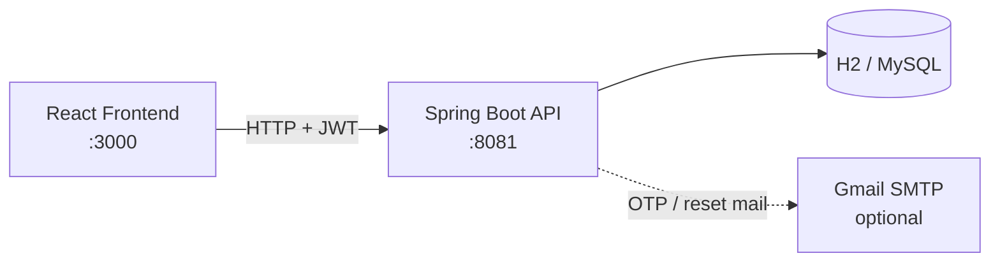
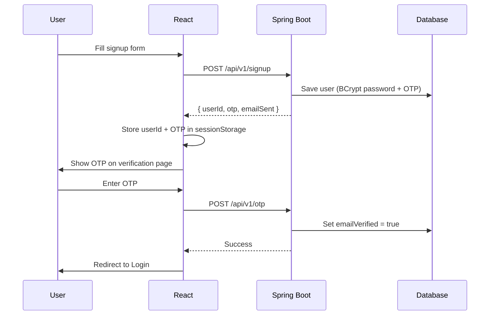
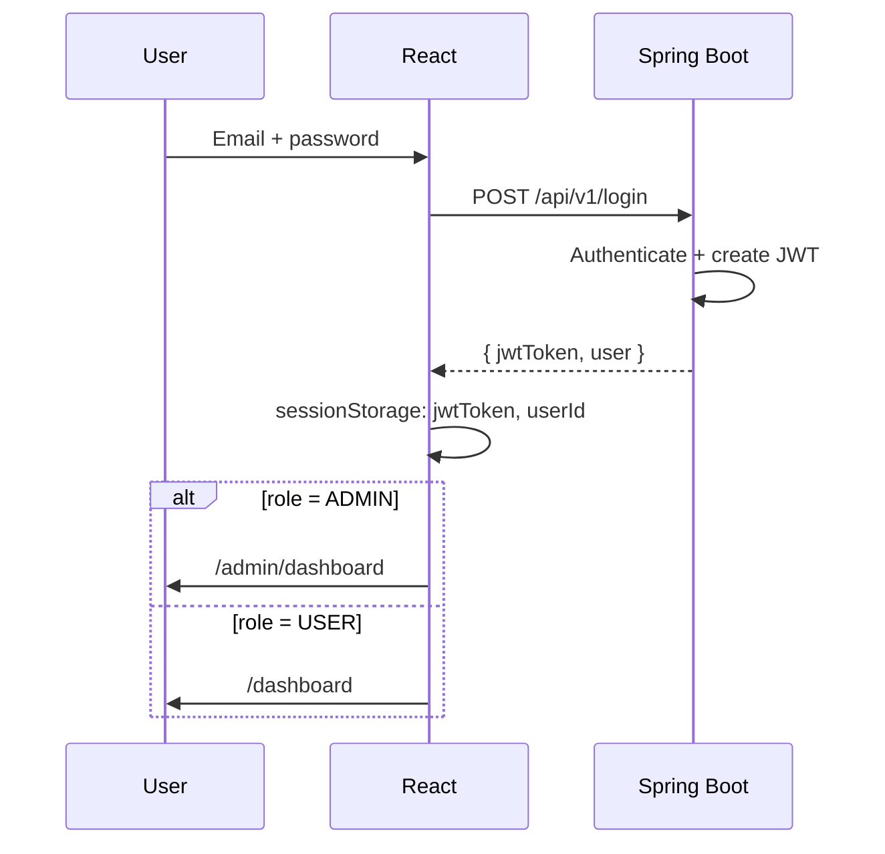
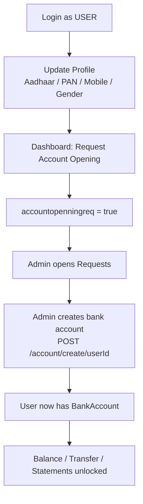
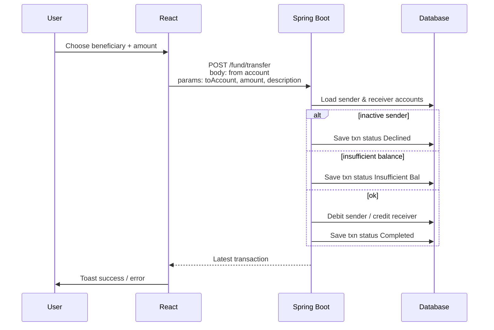
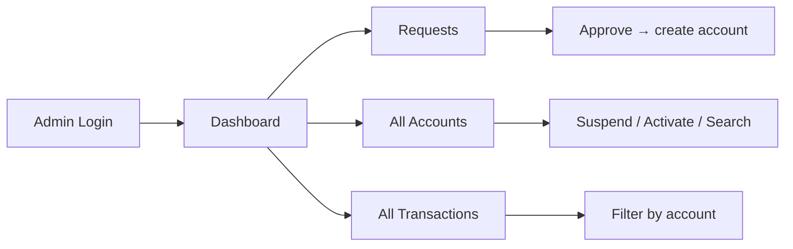
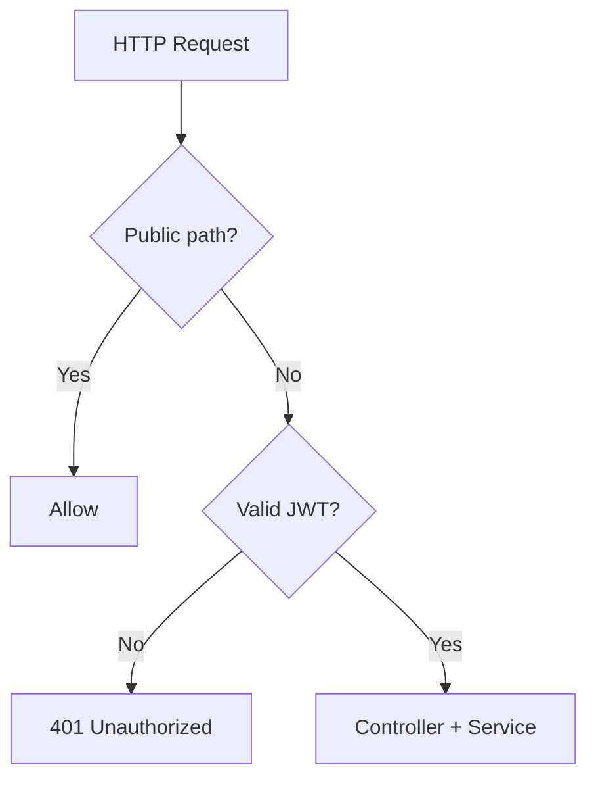

# FundFlow — Project Documentation

**FundFlow** is an online banking management system. Customers can register, open accounts, transfer money, manage beneficiaries, and view statements. Admins can approve account requests, manage accounts, and view transactions.

> **Default admin (local):** `admin@fundflow.com` / `Admin@12345`  
> Login: http://127.0.0.1:3000/login → Admin dashboard: http://127.0.0.1:3000/admin/dashboard  
> Admin pages wait for profile load (no more blank screen). Menu: Requests · Accounts · Transactions

---

## 1. What the project does

| Role | Capabilities |
|------|----------------|
| **Customer (USER)** | Sign up, verify OTP, log in, update profile (Aadhaar/PAN/mobile), request account opening, check balance, transfer funds, manage beneficiaries, view statements, change password, contact admin |
| **Admin (ADMIN)** | Approve/reject account opening requests, view all accounts, suspend/activate accounts, view all transactions |

---

## 2. Tech stack

| Layer | Technology |
|-------|------------|
| Frontend | React 18, React Router, Axios, Tailwind CSS, Flowbite, react-hot-toast |
| Backend | Spring Boot 2.7, Spring Security, JWT, Spring Data JPA |
| Database | H2 (local default) — can switch to MySQL |
| Auth | BCrypt passwords + JWT (Bearer token in `Authorization` header) |
| Mail | Optional Gmail SMTP (`app.mail.enabled`) |

---

## 3. Project structure

```
Fundflow/
├── frontend/                          # React SPA (port 3000)
│   └── src/
│       ├── App.js                     # Routes
│       ├── Components/
│       │   ├── LandingPage/           # Home, navbar, footer
│       │   ├── Registration/          # Signup, OTP, login, password flows
│       │   ├── Dashboard/             # User dashboard, balance, transfer, statements
│       │   ├── Beneficiary/           # Add / list beneficiaries
│       │   ├── Profile/               # KYC-style profile update
│       │   ├── Admin/                 # Admin dashboard, accounts, requests
│       │   ├── Transaction/           # Admin transaction views
│       │   ├── Context/UserContext.js # Global user state + BASE_URL
│       │   ├── Utils/AxiosWithJWT.js  # Axios + JWT interceptor
│       │   └── Protected/             # Route guard (JWT + account required)
│       └── assets/images/
│
└── server/onlinebanking/              # Spring Boot API (port 8081)
    └── src/main/java/bankproject/
        ├── helper/Helper.java         # Date/time helpers
        └── onlinebanking/
            ├── Controllers/           # REST APIs
            ├── Model/                 # JPA entities
            ├── Repository/            # Data access
            ├── Service/ + ServiceImpl/
            ├── Configuration/         # Security + CORS
            ├── Utility/               # JWT filter, util, entry point
            └── Requests/              # DTOs (login, etc.)
```

---

## 4. High-level architecture



**How pieces talk**

1. Frontend calls `http://localhost:8081` (`BASE_URL` in `UserContext`).
2. Public APIs (signup, login, OTP, forgot password) need no token.
3. After login, JWT is stored in `sessionStorage` as `jwtToken`.
4. `AxiosWithJWT` attaches `Authorization: Bearer <token>` on every authenticated request.
5. Backend JWT filter validates the token and sets Spring Security context.
6. Hibernate maps entities to tables (`ddl-auto=update`).

---

## 5. Data model (ER overview)

```mermaid
erDiagram
  USER ||--o| USER_DETAIL : has
  USER ||--o{ BANK_ACCOUNT : owns
  USER ||--o{ BENEFICIARY : saves
  BANK_ACCOUNT ||--o{ TRANSACTION : from_or_to

  USER {
    string userId PK
    string email
    string password
    string role
    boolean emailVerified
    string otp
    boolean accountopenningreq
  }

  USER_DETAIL {
    aadhaar
    pan
    mobile
    gender
    address
  }

  BANK_ACCOUNT {
    long accountno PK
    string accountType
    double balance
    boolean isactive
  }

  BENEFICIARY {
    int beneId PK
    long beneaccountno
    string name
  }

  TRANSACTION {
    long transactionId PK
    long fromAccount
    long toAccount
    double amount
    string status
    string description
  }
```

| Entity | Table | Purpose |
|--------|-------|---------|
| `User` | `userdata` | Login identity, role, OTP, account request flag |
| `UserDetail` | `userdetails` | Profile / KYC fields |
| `BankAccount` | `bankaccount` | Account number, type, balance, active flag |
| `Beneficiaries` | `beneficiaries` | Saved payees for transfers |
| `Transactions` | `transactions` | Transfer history and status |

Roles: `USER`, `ADMIN`.

---

## 6. End-to-end workflows

### 6.1 Customer registration & email verification



**Steps**
1. User signs up with first name, last name, email, password (min 8 chars).
2. Backend creates UUID `userId`, generates 6-digit OTP, hashes password with BCrypt.
3. If `app.mail.enabled=false` (local default), OTP is returned in the API response and shown on screen.
4. User verifies OTP → `emailVerified` becomes `true`.
5. User can log in.

---

### 6.2 Login & session



**Steps**
1. Login validates credentials via Spring Security `AuthenticationManager`.
2. JWT issued (~24h from config).
3. Frontend stores token; later API calls use it automatically.
4. Admin users are routed to the admin dashboard.

---

### 6.3 Profile update → account opening → admin approval



**Why this order?**
- Dashboard blocks account request until profile KYC fields exist.
- Banking features (`/dashboard/balance`, `/trx`, `/Stmt`) are wrapped in `<Protected />`, which requires JWT **and** at least one account.
- Until admin creates the account, user stays on the main dashboard with “Request Account Opening”.

---

### 6.4 Fund transfer



**Business rules**
- Sender account must be active.
- Sender balance must cover amount.
- Both accounts must exist.
- Every attempt creates a transaction row (Completed / Declined / Insufficient Bal).

---

### 6.5 Beneficiaries

1. User adds beneficiary (`POST /beneficiaries/create/{userId}`) with name + account number.
2. List / update / delete via beneficiaries APIs.
3. Transfer UI loads beneficiaries (`GET /beneficiaries/user/{userId}`) as dropdown options.

---

### 6.6 Admin workflow



| Screen | Purpose |
|--------|---------|
| `/admin/dashboard` | Admin home |
| `/admin/dashboard/requests` | Pending account opening requests |
| `/admin/dashboard/accounts` | Search/list accounts, enable/disable users, suspend/activate |
| `/admin/dashboard/transactions` | View global or account-wise transactions |

---

### 6.7 Password reset

1. **Forgot password** → `POST /api/v1/user/forget-password` (email) → reset token emailed (or needs working SMTP).
2. **Reset password** → `POST /api/v1/user/reset-password/{token}`.
3. **Change password** (logged in) → `POST /api/v1/user/change-password/{userId}`.

---

## 7. Frontend routes

| Path | Access | Screen |
|------|--------|--------|
| `/` | Public | Landing page |
| `/signup` | Public | Register |
| `/signup/otp` | Public | OTP verification |
| `/login` | Public | Login |
| `/forgot-password`, `/reset-password` | Public | Password recovery |
| `/change-password` | Auth | Change password |
| `/dashboard` | Auth | User dashboard / account request |
| `/dashboard/balance` | Auth + account | Check balance |
| `/dashboard/trx` | Auth + account | Transfer money |
| `/dashboard/Stmt` | Auth + account | Statements |
| `/dashboard/trx/addbene`, `/seebene` | Auth + account | Beneficiaries |
| `/profile` | Auth | Profile / KYC |
| `/about`, `/contactUs` | Public | Info / contact |
| `/admin/dashboard/*` | Admin | Admin panels |

---

## 8. Backend API map

### Public (no JWT)

| Method | Endpoint | Purpose |
|--------|----------|---------|
| POST | `/api/v1/signup` | Register + create OTP |
| POST | `/api/v1/otp` | Verify email OTP |
| POST | `/api/v1/resend-otp/{userId}` | Resend OTP |
| POST | `/api/v1/login` | Login → JWT |
| POST | `/api/v1/user/forget-password` | Start reset |
| POST | `/api/v1/user/reset-password/{token}` | Finish reset |
| GET | `/api/v1/user/auser?userid=` | Fetch user by id |
| POST | `/api/v1/user/mail` | Contact form mail |

### Authenticated (JWT required)

| Method | Endpoint | Purpose |
|--------|----------|---------|
| PUT | `/api/v1/user/updateprofile/{userId}` | Update profile |
| PUT | `/api/v1/user/acopreq/{userId}` | Request account opening |
| GET | `/api/v1/user/acopreqchng/{userId}` | Admin: process request flag |
| POST | `/account/create/{userId}` | Admin: create account |
| GET | `/account/checkbal/{accountno}` | Balance |
| GET | `/account/getallreq` | Pending requests |
| PUT | `/account/accounts/suspend/{accountno}` | Suspend |
| PUT | `/account/accounts/activate/{accountno}` | Activate |
| POST | `/fund/transfer` | Transfer funds |
| CRUD | `/beneficiaries/...` | Beneficiaries |
| GET | `/transactions/bankaccount/{accountno}` | Statement |
| GET | `/transactions/transaction` | All transactions (admin) |

---

## 9. Security model



- Passwords stored with **BCrypt**.
- API is **stateless** (`SessionCreationPolicy.STATELESS`).
- CORS allows browser origin patterns (`*`) for local React on port 3000.
- JWT secret / expiry configured in `application.properties`.

---

## 10. Typical customer journey (checklist)

1. Open http://127.0.0.1:3000  
2. **Sign up** → note OTP on screen → **Verify**  
3. **Log in**  
4. Go to **Profile** → fill Aadhaar, PAN, mobile, gender → save  
5. **Dashboard** → Request Account Opening  
6. *(Admin)* Log in as ADMIN → **Requests** → create account for user  
7. *(Customer)* Refresh → open **Balance / Transfer / Statements**  
8. Add **Beneficiary** → transfer money → check **Statements**

> There is no seed admin in code by default. Promote a user in DB: set `role = 'ADMIN'` on `userdata`.

---

## 11. How to run

### Backend (8081)

```powershell
cd Fundflow/server/onlinebanking
$env:JAVA_HOME = "C:\Program Files\Microsoft\jdk-17.0.19.10-hotspot"
.\mvnw.cmd spring-boot:run
```

### Frontend (3000)

```powershell
cd Fundflow/frontend
npm install
npm start
```

Open: http://127.0.0.1:3000  

Local DB: embedded **H2** file under `server/onlinebanking/data/`.  
Optional email: set `app.mail.enabled=true` and valid Gmail App Password in `application.properties`.

---

## 12. Key files to remember

| File | Why it matters |
|------|----------------|
| `frontend/src/App.js` | All routes |
| `frontend/src/Components/Context/UserContext.js` | `BASE_URL`, load current user |
| `frontend/src/Components/Utils/AxiosWithJWT.js` | Attaches JWT |
| `server/.../WebSecurityConfig.java` | Public vs protected APIs |
| `server/.../SignUpController.java` | Signup + OTP |
| `server/.../FundTransferController.java` | Money movement rules |
| `server/.../application.properties` | Port, DB, JWT, mail |

---

## 13. Summary

FundFlow is a **full-stack banking simulator**:

- React UI for customers and admins  
- Spring Boot REST API with JWT security  
- Persistent accounts, beneficiaries, and transactions  
- Lifecycle: **Register → Verify → Login → Profile → Account Request → Admin Approval → Banking Operations**

That lifecycle is the core product workflow; every screen and API above supports one step of it.
